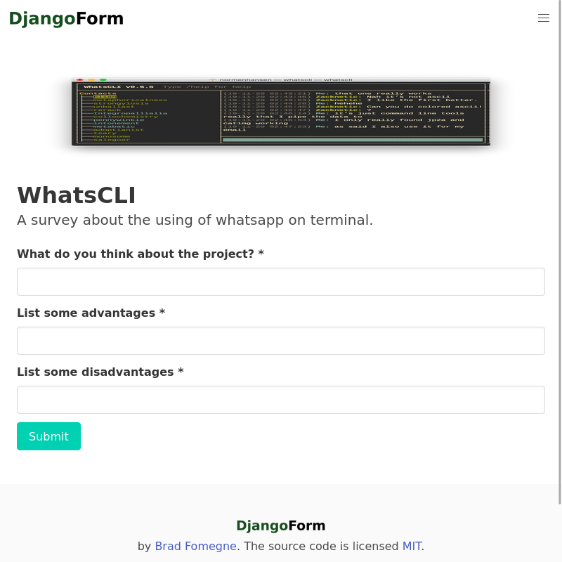

# DjangoForm

## Description
An online survey creator that exploit the power of Django’s forms API. 

## Features

## Table of Contents
* **[Installation](#installation)**
  * [Pip](#pip)
  * [Pipenv](#pipenv)
  * [Maintenance mode](#maintenance-mode)
  * [Docker](#docker)
* [Contributing](#contributing)
* [Support](#support)
* [License](#license)

## Installation
DjangoForm can be installed via Pip, Pipenv, or Docker. To start, clone the repo to your local computer and change into the proper directory.
*NB:* We provide the [raw version](requirements_raw.txt) of the requirements.txt file.

```
$ git clone https://github.com/pythonbrad/django_form.git
$ cd django_form
```

### Pip

```
$ python -m venv .venv

# Windows
$ Set-ExecutionPolicy -ExecutionPolicy RemoteSigned -Scope CurrentUser
$ .venv\Scripts\Activate.ps1

# macOS
$ source .venv/bin/activate

(.venv) $ pip install -r requirements.txt
(.venv) $ python manage.py migrate
(.venv) $ python manage.py createsuperuser
(.venv) $ python manage.py runserver
# Load the site at http://127.0.0.1:8000
```

### Pipenv

```
$ pipenv install
$ pipenv shell
(.venv) $ python manage.py migrate
(.venv) $ python manage.py createsuperuser
(.venv) $ python manage.py runserver
# Load the site at http://127.0.0.1:8000
```

### Environ

Duplicate the .env_example file in .env and configure your Django application.

### Maintenance mode

```
python ./manage.py maintenance_mode <on|off>
```

### Docker

To build the Docker image, run the container, and execute the standard commands within Docker.

```
$ docker-compose up -d --build
$ docker-compose exec web python manage.py migrate
$ docker-compose exec web python manage.py createsuperuser
# Load the site at http://127.0.0.1:8000
```

## 🤝 Contributing

Contributions, issues and feature requests are welcome! See [CONTRIBUTING.md](CONTRIBUTING.md).

## ⭐️ Support

Give a ⭐️  if this project helped you!

## License

[The MIT License](LICENSE)
